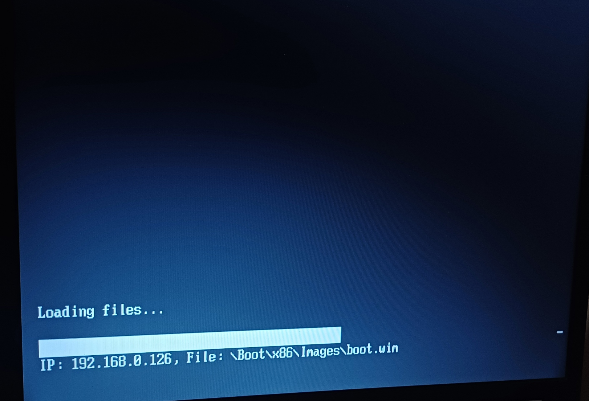
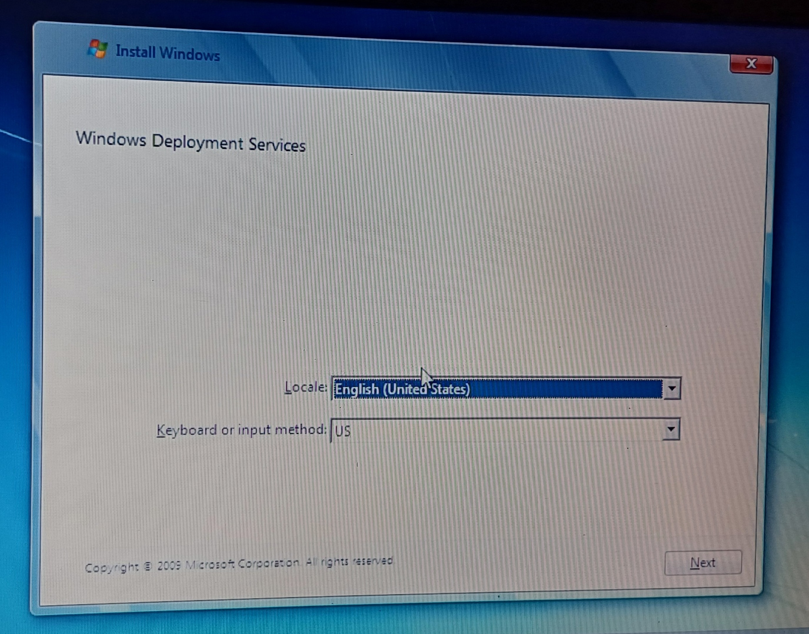

# Aim
A laptop I own has a broken disc drive. I want to install Windows 7 on the laptop. Since I don't have any spare USB flash drives, I thought it would be a fun idea to install Windows 7 via a network install.

## Tools
### Machines
1. VM running Windows Server 2025 configured for bridged network access
2. Toshiba Satellite Pro L20
### Software
1. Windows Server 2025 with Windows Deployment Services role

## Preparing the server for deploying Windows
The first thing I needed to do was add the Windows 7 image to the server. I did this by using my copy of Windows 7 and following the Windows Deployment Services wizard to add the install and boot images of Windows 7 to the server. 

# Network Booting and reaching the desktop
After completing that step I then was able to network boot the Toshiba laptop to the Windows 7 setup by pressing F12 as soon as I turned the laptop on and selecting `LAN` on the boot menu. 

*Laptop booting into Windows setup from WDS on a VM*

*Laptop showing the first page of Windows Setup using WDS*

## Issues Encountered
The only issue encountered was that VMware wasn't correctly assigning a `192.168.0.xxx` IP address to the Windows Server VM. Opening up VMware's Virtual Network Editor, I manually set the external connection to use the correct network adapter as it was set to automatic, and after restarting the VM, the correct IP address was assigned and the laptop was able to boot from the server

## Post-install
Once Windows 7 had fully installed, I downloaded a tool called `Legacy Update` which allows older operating systems to connect to Windows Update and download all updates. During the updating process I checked Device Manager for missing drivers, which there were none.